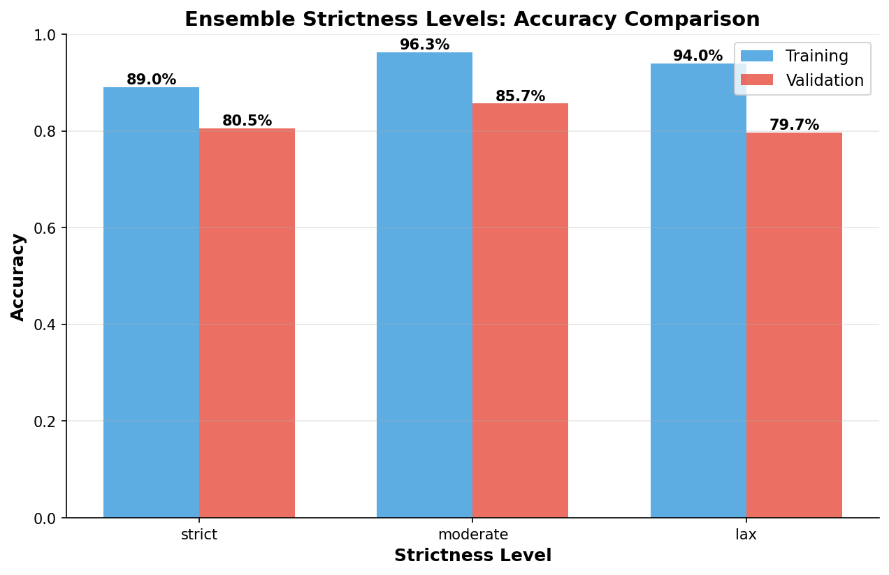
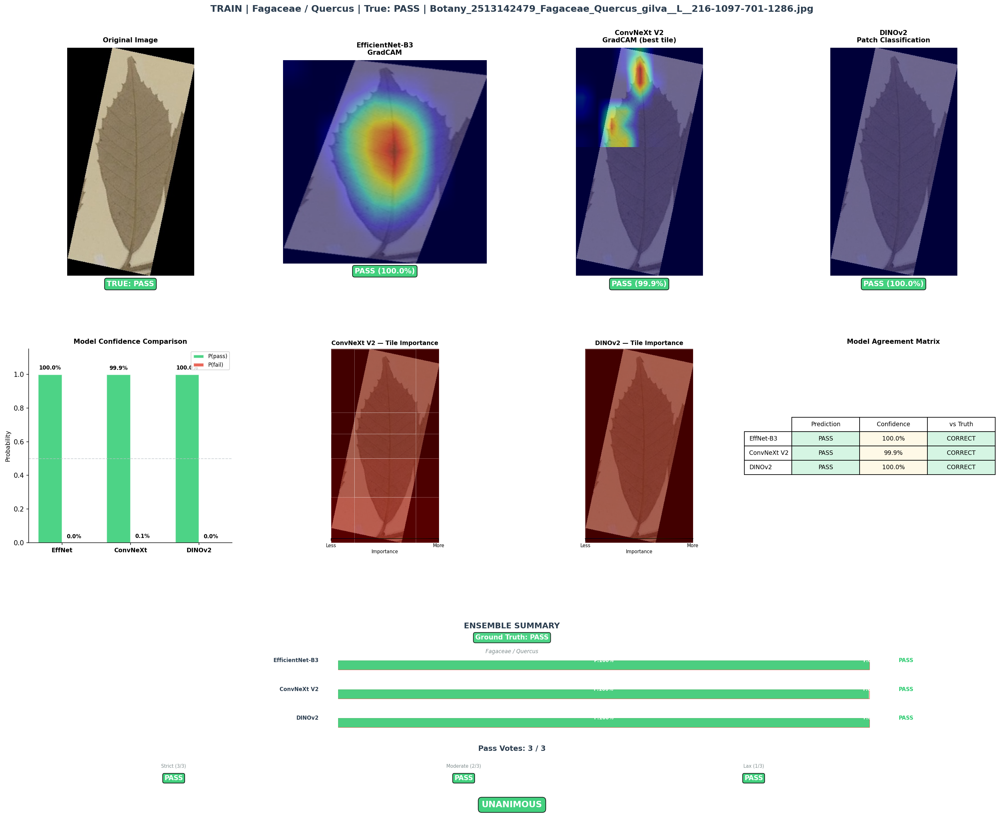
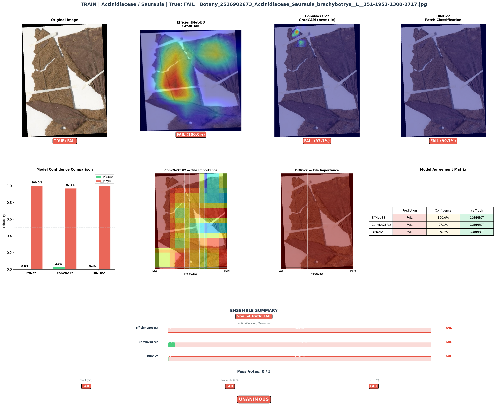
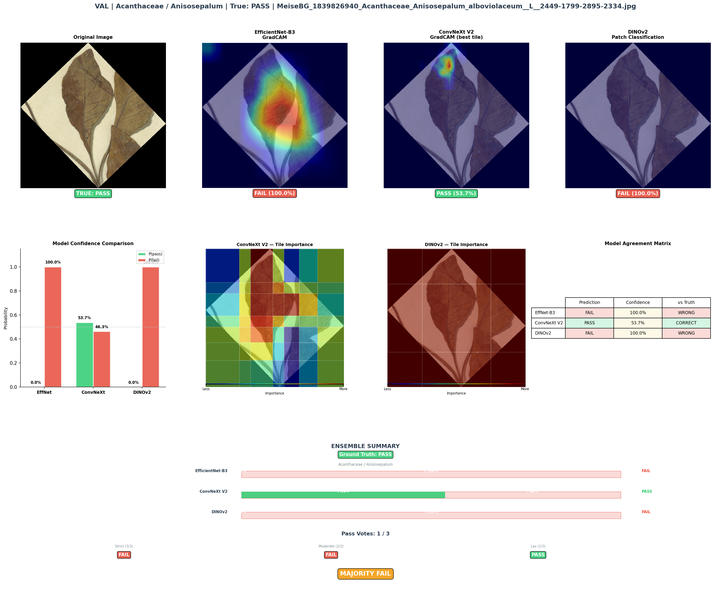

# LM2 Leaf Classifier

A binary image classification system for pass/fail leaf quality assessment using an ensemble of three machine learning models: **DINOv2**, **ConvNeXt V2**, and **EfficientNet-B3**.

The system employs a tile-based approach to handle arbitrary image sizes, extracting features from overlapping image patches and aggregating them for robust classification.

## Features

- **Multi-Model Ensemble** – Combines predictions from 3 independent models for consensus pass/fail decisions
- **Flexible Strictness Levels** – Control ensemble agreement thresholds:
  - `strict` – All 3 models must agree "pass" (3/3)
  - `moderate` – At least 2 models agree "pass" (2/3) **[default]**
  - `lax` – At least 1 model says "pass" (1/3)
- **Flexible Input** – Single image files, entire directories, multiple folders, or glob patterns
- **GPU Support** – Automatic GPU detection with fallback to CPU
- **Lightweight Inference** – ONNX models run without full PyTorch; only `onnxruntime` required
- **Quality Control** – Visualization of model attention maps to understand decision-making

### Strictness Comparison



The visualization above shows how different strictness settings affect pass/fail decisions across a sample dataset. Use `strict` for high-confidence assessments, `moderate` for balanced filtering, or `lax` for inclusive evaluation.

## Quick Start

### Installation

```bash
# Clone the repository
git clone https://github.com/Gene-Weaver/LeafMachine2_Leaf_Classifier.git
cd LeafMachine2_Leaf_Classifier

# Install inference dependencies (lightweight, no training required)
pip install -r requirements.txt

# Download pre-trained model weights (~500 MB)
python download_models.py
```

The `download_models.py` script fetches the latest model weight files from GitHub Releases. This is a one-time setup step.

### Inference

Run ensemble classification on images:

```bash
# Single folder
python ensemble_inference.py --input /path/to/leaves

# Multiple folders
python ensemble_inference.py --input /batch1 /batch2 /batch3

# Specific files
python ensemble_inference.py --input image1.jpg image2.jpg image3.jpg

# Custom output and strictness
python ensemble_inference.py \
  --input /data/leaves \
  --strictness moderate \
  --output my_results.csv
```

**Output:** Single CSV with per-image predictions and model agreement counts.

### Quick Testing (Static Paths)

Edit `ensemble_inference.py`:
1. Set `USE_STATIC_PATHS = True` near the top of `main()`
2. Update `static_config["input"]` with your test paths
3. Run: `python ensemble_inference.py`

## Models

Pre-trained, optimized models (AugColor variants) are included in `models/`:

```
models/
├── efficientnet_b3/      # EfficientNet-B3 ONNX model
├── convnextv2/           # ConvNeXt V2 ONNX model
└── dinov2/               # DINOv2 ViT-B/14 ONNX model
```

Each folder contains:
- `leaf_classifier*.onnx` – Model weights
- `leaf_classifier*.onnx.data` – Model data file (required)
- `model_config*.json` – Tiling and preprocessing configuration

## Command Reference

```bash
python ensemble_inference.py --help
```

### Key Arguments

| Argument | Default | Description |
|----------|---------|-------------|
| `--input` / `-i` | *required* | Image files, folders, or glob patterns |
| `--strictness` / `-s` | `moderate` | `strict`, `moderate`, or `lax` |
| `--output` / `-o` | `ensemble_results.csv` | Output CSV path |
| `--no-recursive` | *off* | Disable recursive folder search |
| `--efficientnet-dir` | `models/efficientnet_b3` | EfficientNet model directory |
| `--convnextv2-dir` | `models/convnextv2` | ConvNeXt V2 model directory |
| `--dinov2-dir` | `models/dinov2` | DINOv2 model directory |

## Output CSV

Each run produces a CSV with:

| Column | Description |
|--------|-------------|
| `filename` | Image file name |
| `fullpath` | Absolute path to image |
| `strictness_setting` | Ensemble strictness level used |
| `ensemble_agreed_pass` | Number of models voting "pass" (0–3) |
| `final_determination` | Final decision: 1 (pass) or 0 (fail) |

Example:
```
filename,fullpath,strictness_setting,ensemble_agreed_pass,final_determination
leaf_001.jpg,/data/leaf_001.jpg,moderate,2,1
leaf_002.jpg,/data/leaf_002.jpg,moderate,1,0
```

## Architecture

### Model Details

Each model follows the same training pipeline:

- **Backbone** – Frozen feature extractor (no gradients)
- **Head** – Lightweight MLP classification head (trained only)
- **Input** – Tiled image patches with configurable overlap
- **Output** – Per-tile logits aggregated via mean pooling

### Tile-Based Inference

For arbitrary image sizes:
1. Image split into overlapping tiles
2. Backbone extracts tile features
3. CLS token features aggregated (mean pooling)
4. MLP head produces final logits
5. Softmax → pass/fail probability

### Ensemble Decision

Each image receives predictions from all 3 models. The final determination depends on strictness:

- **`strict`** – All 3 must predict "pass" → decision = "pass"
- **`moderate`** – 2+ predict "pass" → decision = "pass"
- **`lax`** – 1+ predict "pass" → decision = "pass"

Otherwise → "fail"

See the [strictness comparison chart](strictness_comparison/strictness_comparison.png) for empirical performance across different thresholds.

## Quality Control & Visualization

Visualize which leaf regions the models attend to:

```bash
# Generate attention overlay images (DINOv2)
python run_QC.py dinov2
```

Outputs saved to `qc_output/`.

### Classification Examples

Below are real examples from model training showing attention overlays (which leaf regions influenced the pass/fail decision):

#### Pass Example: *Quercus gilva*


The model correctly identifies quality indicators (veins, texture, shape) and predicts **pass**.

#### Fail Example: *Saurauia brachybotrys*


The model correctly identifies quality issues and predicts **fail**.

#### Pass Example: *Anisosepalum alboviolaceum*


Another successful pass prediction showing consistent quality assessment across plant families.

## Development & Training

See `CLAUDE.md` for detailed training instructions, configuration parameters, and architecture explanations.

### Requirements

**Inference only:**
```
pip install -r requirements.txt
```

**Training (includes inference dependencies):**
```
pip install -r requirements_training.txt
```

## File Structure

```
LM2_Leaf_Classifier/
├── models/                          # Pre-trained models for deployment
│   ├── efficientnet_b3/
│   ├── convnextv2/
│   └── dinov2/
├── qc_output/                       # Example attention visualizations
├── strictness_comparison/           # Analysis and comparison visuals
├── ensemble_inference.py            # Main inference script (CLI + static paths)
├── run_QC.py                        # Quality control visualization
├── train_*.py                       # Training scripts
├── requirements.txt                 # Lightweight inference dependencies
├── requirements_training.txt        # Full training dependencies
├── CLAUDE.md                        # Detailed architecture & configuration guide
└── README.md                        # This file
```

## Performance Notes

- **GPU Memory** – Automatic detection: loads all 3 models if ≥1.2 GB free; sequential loading otherwise
- **Inference Speed** – ~2–5 seconds per image on GPU (varies by image size and model)
- **Tile Extraction** – Configurable overlap and count; sensible defaults included in model configs
- **Class Balance** – Models trained with weighted loss for imbalanced pass/fail distributions

## Examples

### Analyze a single image
```bash
python ensemble_inference.py --input /data/leaf_sample.jpg --output single_result.csv
```

### Batch process multiple folders
```bash
python ensemble_inference.py \
  --input /data/batch_2024_jan /data/batch_2024_feb /data/batch_2024_mar \
  --strictness strict \
  --output batch_results_strict.csv
```

### Use strict consensus for critical assessment
```bash
python ensemble_inference.py --input /data --strictness strict
```

### Use lax for inclusive pass threshold
```bash
python ensemble_inference.py --input /data --strictness lax
```

## Troubleshooting

**No images found:**
- Check path format: use absolute paths or verify relative paths from cwd
- Verify file extensions: `.jpg`, `.jpeg`, `.png`, `.tif`, `.tiff`, `.bmp`, `.webp`

**ONNX file not found:**
- Ensure `models/` folder and subfolders exist
- Check model config files are present

**Out of Memory (OOM):**
- Reduce image size or crop input
- Use `--no-recursive` if processing large directory trees

**Slow inference:**
- Verify GPU is being used (check logs for "CUDA" or "GPU free memory")
- Reduce batch tile count in model config if needed

## References

- **DINOv2** – Self-supervised vision transformer ([Meta AI](https://github.com/facebookresearch/dinov2))
- **ConvNeXt V2** – Modern CNN architecture ([timm](https://github.com/huggingface/pytorch-image-models))
- **EfficientNet** – Efficient CNN scaling ([TensorFlow](https://github.com/tensorflow/models/tree/master/research/slim/nets/efficientnet))
- **ONNX Runtime** – Cross-platform inference ([onnxruntime.ai](https://onnxruntime.ai))

## License

[Add your license here]

## Contact

[Add contact information]

---

For detailed training, configuration, and architecture information, see **[CLAUDE.md](CLAUDE.md)**.
